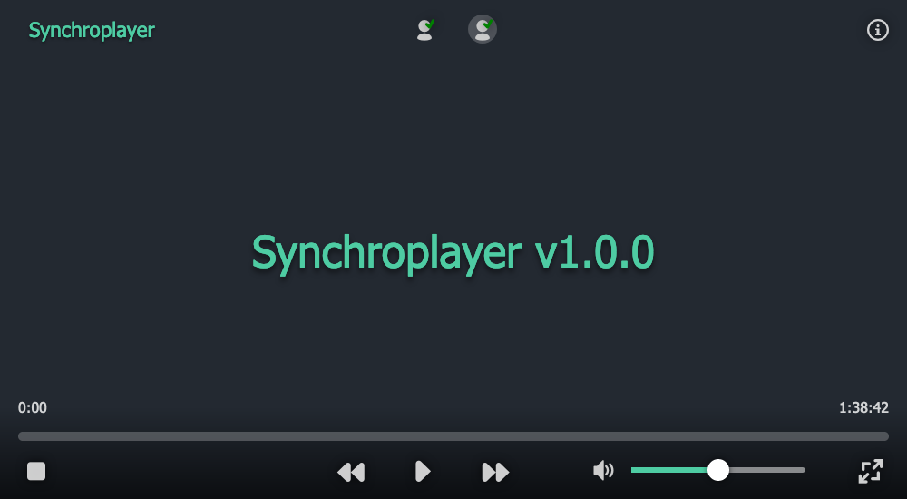

# Synchroplayer

Synchronized video player for watching videos together remotely.

Demo: https://movie.tom32i.fr

## Currently supported contents

| Content | Format | Method |
| ------- | ------ | ------ |
| Local video files | `.mp4`, `.mkv`, `.mov` | Drag & drop |
| Local subtitles files | `.vtt`, `.srt` | Drag & drop |
| Remote video url | Any url | Copy & paste |
| Youtube video url | `https://www.youtube.com/watch?v=BathEBfiG1s`, `https://youtu.be/BathEBfiG1s` | Copy & paste |

## License

[MIT](./LICENSE)
